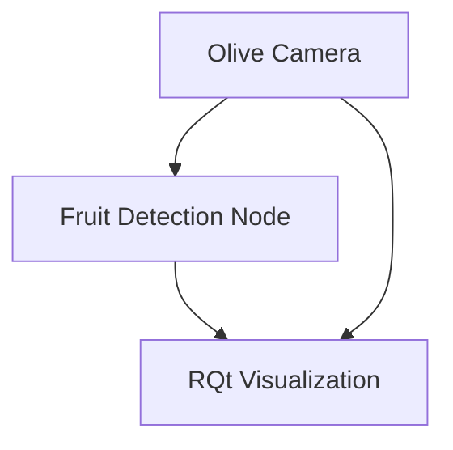
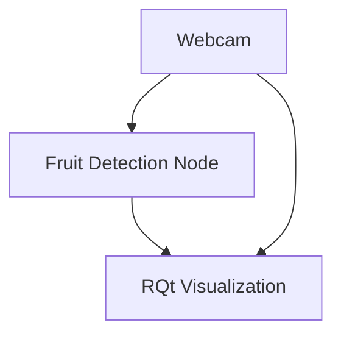
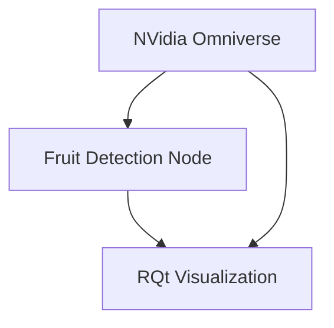

# Fruit detection

# Requisites

- [Docker](https://docs.docker.com/engine/install/ubuntu/)
- Ubuntu 20.04 / 22.04
- NVidia GPU GeForce RTX 3070 or higher.
- [NVidia GPU Driver](https://www.nvidia.com/en-us/drivers/unix/)
- [NVidia Container Toolkit](https://github.com/NVIDIA/nvidia-container-toolkit)
- [Omniverse-launcher](https://www.nvidia.com/en-us/omniverse/download/)
- [Nucleus](https://docs.omniverse.nvidia.com/nucleus/latest/workstation/installation.html)

We recommend reading this [article](https://docs.omniverse.nvidia.com/isaacsim/latest/installation/install_container.html) from NVidia Omniverse which explains the basic configuration.

> **NOTE:** this project is disk savvy, make sure to have tens of GBs (~50GB) available of free disk space.

## Pre-commit configuration - contributors only

This projects uses pre-commit hooks for linting. To install and make sure they are run when committing:

```bash
python3 -m pip install -U pre-commit
pre-commit install
```

If you want to run the linters but still not ready to commit you can run:

```bash
pre-commit run --all-files
```

# Documentation

## Architecture

Within the docker directory you'll find a docker compose file, the dockerfiles for each image and some custom configuration files.
The system relies on using profiles to select which set of services build and run depending on the workflow. The following sections explain how to deal with them.

## Profiles

The available profiles are:

- `training`: trains a fasterrcnn_resnet50_fpn model based on a synthetic dataset.
- `detection`: loads the detection stack.
- `visualization`: loads RQt to visualize the input and output image processing.
- `webcam`: loads the usb_cam driver that makes a connected webcam to publish. Useful when the Olive Camera is not available.
- `simulation`: loads the simulation NVidia Isaac Omniverse.
- `dataset_gen`: generates a training dataset using NVidia Isaac Omniverse.

Compound profiles are:

- `olive_pipeline`: loads `visualization` and `detection`, expects the Olive Camera to be connected.



- `webcam_pipeline`: loads `webcam`,`visualization` and `detection`.



- `simulated_pipeline`: loads `simulation`,`visualization` and `detection`.



Testing profiles are:

- `training_test`: runs the tests for the training stack.
- `detection_test`: runs the tests for the detection stack.

## Build the images

> TODO (#16): run `export DATASET_PATH=/tmp` and then override it after generating a dataset to bypass this issue.

To build all the docker images:

```bash
docker compose -f docker/docker-compose.yml --profile "*" build
```
## Dataset generation

It generates a dataset with 300 annotated pictures where many scene conditions are randomized such as lighting and object pose.

To generate a new dataset:

```bash
docker compose -f docker/docker-compose.yml --profile dataset_gen up
```

The following .gif video shows pictures where the ground plane conditions color is randomized having a better dataset for the simulation.


And once it finishes (note the scene does not evolve anymore) check the generated folder under `isaac_ws/datasets/YYYYMMDDHHMMSS_out_fruit_sdg` where `YYYYMMDDHHMMSS` is the stamp of the dataset creation.

## Training the model

To train a model you need a NVidia Omniverse synthetic dataset built in the previous step. You first need to set up the following environment variable:

```bash
export DATASET_PATH=$(pwd)/isaac_ws/datasets/YYYYMMDDHHMMSS_out_fruit_sdg
```

Then you can run the training using the training profile:

```bash
docker compose -f docker/docker-compose.yml --profile training up
```

After the training ends, a `model.pth` file will be available inside `model`. Additionally, you will notice that the dataset files were organized in different folders based on their extension. To test the model you can run:

```bash
docker compose -f docker/docker-compose.yml --profile training_test up
```

This will evaluate every image in the `DATASET_PATH` and generate annotated images in the `model` folder.

## Run

To run the system you need to define which profile(s) to run. You can pile profiles by adding them one after the other to have a custom bring up of the system (e.g.`--profile detection --profile visualization`).

### Running olive_pipeline

To load the system with the Olive Camera, detection and the visualization in RQt, you can do the following:

1. Connect the camera to the USB port of your computer.

2. Assuming you have already built a detection model, run the following command:

```bash
docker compose -f docker/docker-compose.yml --profile olive_pipeline up
```

3. Verify you can see in the camera input and the processed images in RQt.

4. To stop the system you can Ctrl-C or from another terminal call:

```bash
docker compose -f docker/docker-compose.yml --profile olive_pipeline down
```

### Running webcam_pipeline

To load the system with a webcam, detection and the visualization in RQt, you can do the following:

1. Connect the camera to your computer or make sure the integrated webcam is working on your laptop.

2. Assuming you have already built a detection model, run the following command:

```bash
docker compose -f docker/docker-compose.yml --profile webcam_pipeline up
```

3. Verify you can see in the camera input and the processed images in RQt.

4. To stop the system you can Ctrl-C or from another terminal call:

```bash
docker compose -f docker/docker-compose.yml --profile webcam_pipeline down
```

### Running simulated_pipeline

To load the system with the simulation, detection and the visualization in RQt, you can do the following:

1. Assuming you have already built a detection model, run the following command:

```bash
docker compose -f docker/docker-compose.yml --profile simulated_pipeline up
```

3. Verify you can see in the camera input and the processed images in RQt as well as having the simulator window up.

4. To stop the system you can Ctrl-C or from another terminal call:

```bash
docker compose -f docker/docker-compose.yml --profile simulated_pipeline down
```

## Test

### Detection stack

```bash
docker compose -f docker/docker-compose.yml --profile detection_test build
```

# FAQs

1. How do I clean up all the docker resources?

Your good old friend `docker system prune` and the more agressive `docker system prune --all`. **Caution:** it will likely erase stuff you didn't want to erase as it is a blanket prune. Read the documentation for more information.

2. Do you have problems with XWindows?

```bash
xhost +si:localuser:root
```
