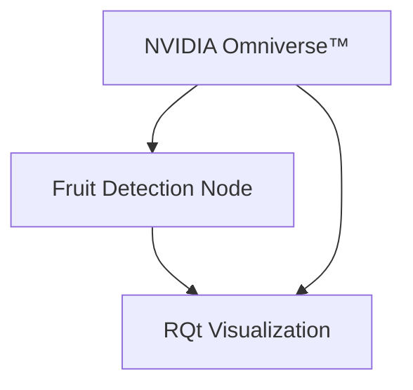
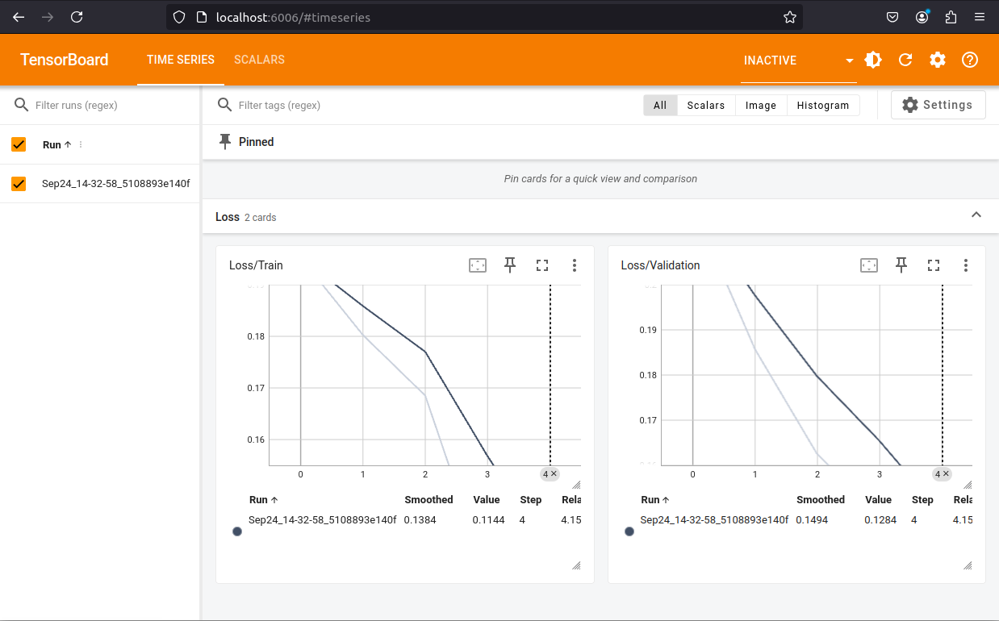
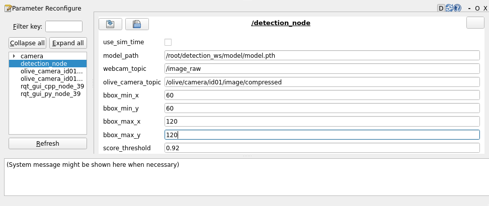

# Fruit detection

# Requisites

- [Docker](https://docs.docker.com/engine/install/ubuntu/)
- Ubuntu 20.04 / 22.04
- NVIDIA GPU GeForce RTX 3070 or higher.
- [NVIDIA GPU Driver](https://www.NVIDIA.com/en-us/drivers/unix/)
- [NVIDIA Container Toolkit](https://github.com/NVIDIA/nvidia-container-toolkit)
- [NVIDIA Omniverse™ Launcher](https://www.nvidia.com/en-us/omniverse/download/)
- [NVIDIA Omniverse™ Nucleus](https://docs.omniverse.nvidia.com/nucleus/latest/workstation/installation.html)

We recommend reading this [article](https://docs.omniverse.nvidia.com/isaacsim/latest/installation/install_container.html) from NVIDIA Omniverse™ which explains the basic configuration.

> **NOTE:** this project is disk savvy, make sure to have tens of GBs (~50GB) available of free disk space.

## Pre-commit configuration - contributors only

This projects uses pre-commit hooks for linting. To install and make sure they are run when committing:

```bash
python3 -m pip install -U pre-commit
pre-commit install
```

If you want to run the linters but still not ready to commit you can run:

```bash
pre-commit run --all-files
```

# Documentation

## Architecture

Within the docker directory you'll find a docker compose file, the dockerfiles for each image and some custom configuration files.
The system relies on using profiles to select which set of services build and run depending on the workflow. The following sections explain how to deal with them.

## Profiles

The available profiles are:

- `training`: trains a fasterrcnn_resnet50_fpn model based on a synthetic dataset.
- `detection`: loads the detection stack.
- `visualization`: loads RQt to visualize the input and output image processing.
- `webcam`: loads the usb_cam driver that makes a connected webcam to publish. Useful when the Olive Camera is not available.
- `simulation`: loads the simulation NVIDIA Omniverse™.
- `dataset_gen`: generates a training dataset using NVIDIA Omniverse™.

Compound profiles are:

- `olive_pipeline`: loads `visualization` and `detection`, expects the Olive Camera to be connected.


- `webcam_pipeline`: loads `webcam`,`visualization` and `detection`.


- `simulated_pipeline`: loads `simulation`,`visualization` and `detection`.



Testing profiles are:

- `training_test`: runs the tests for the training stack.
- `detection_test`: runs the tests for the detection stack.

## Build the images

To build all the docker images:

```bash
docker compose -f docker/docker-compose.yml --profile "*" build
```

> **NOTE:** there will be a warning as follows, we will take care of that environment variable later on.

```bash
WARN[0000] The "DATASET_NAME" variable is not set. Defaulting to a blank string.
WARN[0000] The "DATASET_NAME" variable is not set. Defaulting to a blank string.
```

## Dataset generation

It generates a dataset with 300 annotated pictures where many scene conditions are randomized such as lighting and object pose.

To generate a new dataset:

```bash
docker compose -f docker/docker-compose.yml --profile dataset_gen up
```

The following .gif video shows pictures where the ground plane conditions color is randomized having a better dataset for the simulation.


And once it finishes (note the scene does not evolve anymore) check the generated folder under `isaac_ws/datasets/YYYYMMDDHHMMSS_out_fruit_sdg` where `YYYYMMDDHHMMSS` is the stamp of the dataset creation.

Typically 300 images are not enough. For a quick iteration it is recommended to go with 300 images to validate everything works as expected. When running the system for training a model more seriously you can go up to five thousands and spend between 15 and 20 minutes in doing so. You can quickly change the number of images to generate by editing `./isaac_ws/simulation_ws/conf/config.yml` and look for the `NUM_FRAMES` item.

## Training the model

To train a model you need a NVIDIA Omniverse™ synthetic dataset built in the previous step. You first need to set up the following environment variable:

```bash
export DATASET_NAME=YYYYMMDDHHMMSS_out_fruit_sdg
```

Then you can run the training using the training profile:

```bash
docker compose -f docker/docker-compose.yml --profile training up
```

After the training ends, a `model.pth` file will be available inside `model`. Additionally, you will notice that the dataset files were organized in different folders based on their extension. To test the model you can run:

```bash
docker compose -f docker/docker-compose.yml --profile training_test up
```

This will evaluate every image in the `DATASET_NAME` and generate annotated images in the `model/test_output` folder.

### Training logs visualization

The logs generated when training a model are stored in the `model/runs` folder and they can be visualized using the profile `training_vis`. This profile runs Tensorboard over `localhost:6006`, and can be accessed via a web browser. To run the Tensorboard server, execute:

```bash
docker compose -f docker/docker-compose.yml --profile training_vis up
```



## Run

To run the system you need to define which profile(s) to run. You can pile profiles by adding them one after the other to have a custom bring up of the system (e.g.`--profile detection --profile visualization`).

### Running olive_pipeline

To load the system with the Olive Camera, detection and the visualization in RQt, you can do the following:

1. Connect the camera to the USB port of your computer.

2. Assuming you have already built a detection model, run the following command:

```bash
docker compose -f docker/docker-compose.yml --profile olive_pipeline up
```

3. Verify you can see in the camera input and the processed images in RQt.

4. To stop the system you can Ctrl-C or from another terminal call:

```bash
docker compose -f docker/docker-compose.yml --profile olive_pipeline down
```

### Running webcam_pipeline

To load the system with a webcam, detection and the visualization in RQt, you can do the following:

1. Connect the camera to your computer or make sure the integrated webcam is working on your laptop.

2. Assuming you have already built a detection model, run the following command:

```bash
docker compose -f docker/docker-compose.yml --profile webcam_pipeline up
```

3. Verify you can see in the camera input and the processed images in RQt.

4. To stop the system you can Ctrl-C or from another terminal call:

```bash
docker compose -f docker/docker-compose.yml --profile webcam_pipeline down
```

**NOTE:** In case the default configuration is not appropriate for you hardware setup, please review the documentation of the [usb_cam](https://github.com/ros-drivers/usb_cam/blob/0.8.1/README.md) package.
In particular, it is typical to find setups with multiple video devices, and to pick the one you want, you need to explicitly configure it in [camera_params.yml](./docker/camera_params.yml). Here you can find a reference [configuration file](https://github.com/ros-drivers/usb_cam/blob/0.8.1/config/params_1.yaml).
To make sure your changes are effective, build the camera profile before running it again:

```bash
docker compose -f docker/docker-compose.yml --profile webcam build
```

### Running simulated_pipeline

To load the system with the simulation, detection and the visualization in RQt, you can do the following:

1. Assuming you have already built a detection model, run the following command:

```bash
docker compose -f docker/docker-compose.yml --profile simulated_pipeline up
```

3. Verify you can see in the camera input and the processed images in RQt as well as having the simulator window up.

4. To stop the system you can Ctrl-C or from another terminal call:

```bash
docker compose -f docker/docker-compose.yml --profile simulated_pipeline down
```


### Parameter tuning

The following detection node parameters are exposed and can be modified via rqt_gui when running any pipeline. Please note that values set outside of their range will simply be discarded.




#### Bounding box

The parameters `bbox_min_x`, `bbox_min_y`, `bbox_max_x`, `bbox_max_y` are measured in pixels. `bbox_min_x` and `bbox_max_x` can take values between 0 and 640. `bbox_min_y` and `bbox_max_y` can take values between 0 and 480. They can be used to filter the inferences based on the size of the bounding boxes generated.

#### Score threshold

The parameter `score_threshold` takes values between 0.0 and 1.0. It can be used to filter inferences based on their confidence values.

## Bonus track: rosbags

It's always useful to record rosbags to try the system outside the laboratory or to share data among teammates.

1. Build the rosbag profile:

```bash
docker compose -f docker/docker-compose.yml --profile rosbag build
```

2. Run the service:

```bash
docker compose -f docker/docker-compose.yml --profile rosbag up
```

3. Attach a console to it and source ROS 2 installation:

```bash
docker exec -it rosbag bash
source /opt/ros/humble/setup.bash
```

4. With a running system (see any of the aforementioned run ways), record the Olive Camera:

```bash
ros2 bag record -s mcap -o my_rosbag /olive/camera/id01/image/compressed
```

Press Ctrl-C to stop recording.

5. You can try to play it back now:

```bash
ros2 bag play my_rosbag
```


## Test

### Detection stack

```bash
docker compose -f docker/docker-compose.yml --profile detection_test build
```

# Contributing

Issues or PRs are always welcome! Please refer to [CONTRIBUTING](CONTRIBUTING.md) document.

# Code of Conduct

The free software code of conduct fosters an inclusive, respectful community for contributors by promoting collaboration and mutual respect. For more details, refer to the full document [Code of Conduct](CODE_OF_CONDUCT.md).

# FAQs

1. How do I clean up all the docker resources?

Your good old friend `docker system prune` and the more agressive `docker system prune --all`. **Caution:** it will likely erase stuff you didn't want to erase as it is a blanket prune. Read the documentation for more information.

2. Do you have problems with XWindows?

```bash
xhost +si:localuser:root
```

3. Running the NVIDIA Omniverse™ together with Google Chrome yields errors when opening the simulator. What do I do?

We faced some situations in which precedence of access to the GPU yields to race conditions between these two programs. One possible solution is to do the following:

- Close all Google Chrome related processes.
- Try to open the simulator using one of the provided instructions in the readme.
- Verify that you can open the simulator, otherwise, perhaps you need to reboot your system :/ and try again.

4. Detection calibration

You may need to further calibrate the detection node post-training. This is usually done considering the ambient conditions. We offer two parameters via dynamic reconfigure to be used. Refer to the "Parameter tuning" section for further details.
